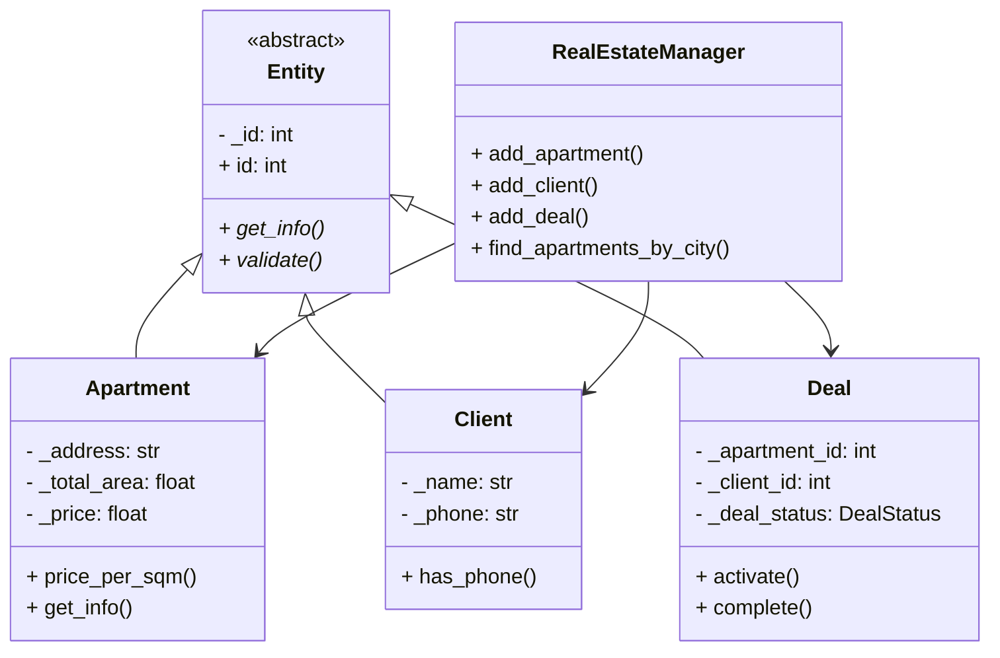

# Недвижимость (Квартиры/Сделки/Клиенты)

## Цель работы
Закрепление принципов ООП (инкапсуляция, наследование, полиморфизм, абстракция) на примере модели «Недвижимость» с интеграцией с БД SQLite.

## Технологии
- Python 3
- SQLite (встроенная библиотека `sqlite3`)
- Консольное приложение

## Структура проекта
```
project/
├── database/
│ ├── db_handler.py # Работа с SQLite
│ ├── errors.py # Исключения
│ ├── schema.sql # SQL-схема таблиц
│ └── types.py # Enum'ы (DealType, DealStatus, PropertyType)
├── models/
│ ├── entity.py # Абстрактный класс Entity
│ ├── apartment.py # Класс Квартира
│ ├── client.py # Класс Клиент
│ └── deal.py # Класс Сделка
├── manager/
│ └── real_estate_manager.py # Менеджер (CRUD + поиск)
├── create_demo_db.py # Создание БД с демо-данными
├── main.py # Демонстрация работы методов
├── console_ui.py # Консольное меню для ручного управления
└── real_estate_demo.db # Файл БД (создаётся автоматически)
```

## Модель данных (БД)

**Таблица `apartments`**  
- id, address, city, total_area, rooms, floor, price, property_type, is_available

**Таблица `clients`**  
- id, name, phone, email

**Таблица `deals`**  
- id, apartment_id, client_id, deal_type, deal_status, amount  
- внешние ключи на apartments.id и clients.id

Полный SQL в файле `database/schema.sql`.

## Основные классы

### `Entity` (абстрактный)
- Приватное поле `_id`
- Абстрактные методы `get_info()` и `validate()`
- Геттер/сеттер для `id`

### `Apartment`, `Client`, `Deal` (наследники)
- Приватные поля с `@property` (инкапсуляция)
- Бизнес-методы:
  - `Apartment.price_per_sqm()` – цена за м²
  - `Client.has_phone()` – проверка наличия телефона
  - `Deal.activate()`, `Deal.complete()` – смена статуса
- Реализация `get_info()` и `validate()`

### `RealEstateManager` (менеджер)
- Методы: `add_*`, `get_*`, `get_all_*`, `update_*`, `delete_*`, простой поиск (`find_apartments_by_city`, `find_deals_by_status`)
- Все операции сразу фиксируются (`commit`)
- Использует `DBHandler` для низкоуровневого доступа

## Валидация и исключения
- При некорректных данных (пустой адрес, цена ≤ 0 и т.п.) выбрасывается `ValidationError`
- В `main.py` показан пример перехвата исключения

## Запуск

1. **Создать базу с демо-данными** (один раз):
    python create_demo_db.py
2. **Демонстрация**
    python main.py
3. **Меню**
    python Therminal UI.py

##  Пример работы (вывод main.py)

    --- Квартиры ---
    Кв. ул. Пушкина 15, Москва, 2к, 75.0м², 9500000 руб.
    --- Клиенты ---
    Клиент Иван Петров, тел:+79991234567, email:ivan@mail.ru
    --- Сделки ---
    Сделка 1: кв.1, клиент 1, 9500000 руб., статус Черновик

    Цена за м²: 126666.67
    Активация сделки 2: True
    Завершение: True
    Новый статус: Завершена

    Квартиры в Москве: 1
    Кв. ул. Пушкина 15, Москва, 2к, 75.0м², 9500000 руб.

## UML-Диаграмма
