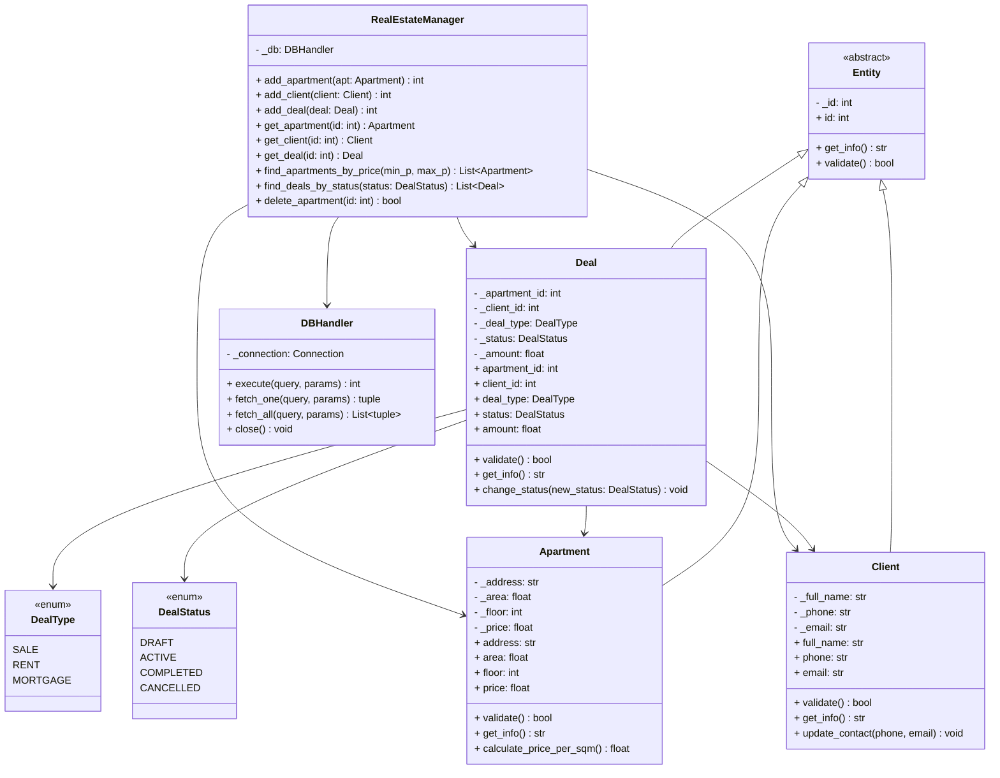

# Недвижимость (Квартиры/Сделки) (Python + SQLite)

## 🧾 Задача

Закрепление принципов объектно-ориентированного программирования (инкапсуляция, наследование, полиморфизм, абстракция) на примере разработки модели предметной области **«Недвижимость (Квартиры/Сделки)»** с последующей интеграцией с базой данных.

## 📌 Описание проекта

Данный проект представляет собой систему управления объектами недвижимости и сделками с ними, реализованную с использованием объектно-ориентированного подхода и базы данных SQLite.

Система поддерживает:
- Учет квартир (площадь, этаж, адрес, цена).
- Ведение базы клиентов (покупатели/продавцы).
- Оформление сделок (купля/продажа/аренда) с отслеживанием статусов.
- Валидацию данных перед сохранением.
- Полную изоляцию бизнес-логики и слоя доступа к данным.

---

## 🧱 Архитектура проекта

Проект построен по принципу разделения ответственности (Separation of Concerns):

- **Models** (`models/`) → описывают сущности (Квартира, Клиент, Сделка).
- **Manager** (`manager/`) → бизнес-логика и CRUD операции.
- **Database** (`database/`) → работа с БД, типы данных, обработка ошибок.
- **SQLite** → хранение данных.

### UML-диаграмма классов



---

## 🧬 Модель данных (База Данных)

Используются три основные таблицы с внешними ключами для обеспечения целостности данных.

### 1. Таблица `apartments`
| Поле | Тип | Описание |
| :--- | :--- | :--- |
| id | INTEGER | Первичный ключ (PK) |
| address | TEXT | Адрес объекта |
| area | REAL | Площадь (м²) |
| floor | INTEGER | Этаж |
| price | REAL | Стоимость |

### 2. Таблица `clients`
| Поле | Тип | Описание |
| :--- | :--- | :--- |
| id | INTEGER | Первичный ключ (PK) |
| full_name | TEXT | ФИО клиента |
| phone | TEXT | Телефон |
| email | TEXT | Email |

### 3. Таблица `deals`
| Поле | Тип | Описание |
| :--- | :--- | :--- |
| id | INTEGER | Первичный ключ (PK) |
| apartment_id | INTEGER | Внешний ключ (FK) → apartments.id |
| client_id | INTEGER | Внешний ключ (FK) → clients.id |
| deal_type | TEXT | Тип сделки (SALE, RENT...) |
| status | TEXT | Статус (DRAFT, ACTIVE...) |
| amount | REAL | Сумма сделки |

Полный SQL-скрипт создания таблиц доступен в [`database/schema.sql`](database/schema.sql).

---

## 🧠 Основные компоненты

### 🔹 Entity (Абстрактный базовый класс)
Находится в `models/entity.py`.
Содержит:
- Приватное поле `_id`.
- Абстрактные методы `get_info()` и `validate()`.
- Декораторы `@property` для инкапсуляции.

### 🔹 Apartment, Client, Deal
Классы-наследники, реализующие конкретную логику:
- **Apartment**: расчет цены за кв. метр, проверка площади и этажности.
- **Client**: форматирование контакта, проверка телефона.
- **Deal**: смена статуса, проверка соответствия суммы и типа сделки.

### 🔹 RealEstateManager
Находится в `manager/real_estate_manager.py`.
Реализует бизнес-логику:
```python
add_apartment(apartment: Apartment) -> int
get_client(id: int) -> Client
find_deals_by_status(status: DealStatus) -> List[Deal]
delete_apartment(id: int) -> bool
```
Использует полиморфизм: принимает объекты разных классов, но сохраняет их в соответствующие таблицы.

### 🔹 DBHandler
Находится в `database/db_handler.py`.
Низкоуровневый слой работы с SQLite:
- Управление соединением.
- Параметризированные запросы (защита от SQL-инъекций).
- Транзакции (автоматический commit/rollback).

---

## 🔄 Поток данных

**Сценарий создания сделки:**
1. Пользователь создает объекты `Apartment` и `Client`.
2. Менеджер сохраняет их в БД через `DBHandler`, получая `id`.
3. Создается объект `Deal`, связывающий `apartment_id` и `client_id`.
4. Вызывается `validate()` у сделки (проверка, что квартира и клиент существуют).
5. Менеджер сохраняет сделку в таблицу `deals`.

**Сценарий поиска:**
1. Запрос `find_apartments_by_price(min, max)`.
2. Менеджер формирует SQL `SELECT ... WHERE price BETWEEN ? AND ?`.
3. Полученные строки преобразуются обратно в объекты класса `Apartment`.

---

## 🛡 Валидация и Безопасность

### Валидация
Происходит на двух уровнях:
1. **В сеттерах (@property.setter)**: проверка типов данных и диапазонов (например, площадь > 0).
2. **В методе validate()**: комплексная проверка логики (например, сумма сделки не может быть отрицательной).

### Безопасность
Все запросы к БД используют параметризацию:
```python
cursor.execute("SELECT * FROM apartments WHERE price < ?", (max_price,))
```
Это полностью исключает возможность SQL-инъекций.

---

## ▶️ Запуск проекта

### Требования
- Python 3.8+
- Стандартная библиотека (модуль `sqlite3` встроен).

### Установка и запуск
1. Клонируйте или скачайте проект.
2. Откройте терминал в папке проекта.
3. Запустите демонстрационный скрипт:

```bash
python main.py
```

Скрипт автоматически создаст базу данных `real_estate.db` при первом запуске.

---

## 🧪 Тестирование

Проект покрыт модульными тестами (библиотека `unittest`).

**Запуск тестов:**
```bash
python -m unittest discover tests
```

**Что проверяют тесты:**
- Корректность работы геттеров/сеттеров.
- Логику методов `validate()` (отклонение некорректных данных).
- CRUD-операции менеджера (создание, чтение, удаление).
- Поиск по критериям.
- Целостность связей в БД.

Результат успешного прохождения тестов:
```
.....................
----------------------------------------------------------------------
Ran 27 tests in 0.045s

OK
```

---

## 📂 Структура проекта

```text
lab_21_real_estate/
├── assets/                 # Изображения для отчета
├── database/
│   ├── __init__.py
│   ├── db_handler.py       # Класс работы с БД
│   ├── errors.py           # Пользовательские исключения
│   ├── schema.sql          # DDL скрипт
│   └── types.py            # Enum (DealType, DealStatus)
├── manager/
│   ├── __init__.py
│   └── real_estate_manager.py # Бизнес-логика
├── models/
│   ├── __init__.py
│   ├── entity.py           # Абстрактный базовый класс
│   ├── apartment.py        # Класс Квартира
│   ├── client.py           # Класс Клиент
│   └── deal.py             # Класс Сделка
├── tests/
│   └── test_models_and_manager.py # Юнит-тесты
├── main.py                 # Точка входа (демо)
├── README.md               # Документация
└── real_estate.db          # Файл БД (создается при запуске)
```

## 👨‍💻 Автор
Студент группы [Ваша Группа]  
ФИО: [Ваше ФИО]
